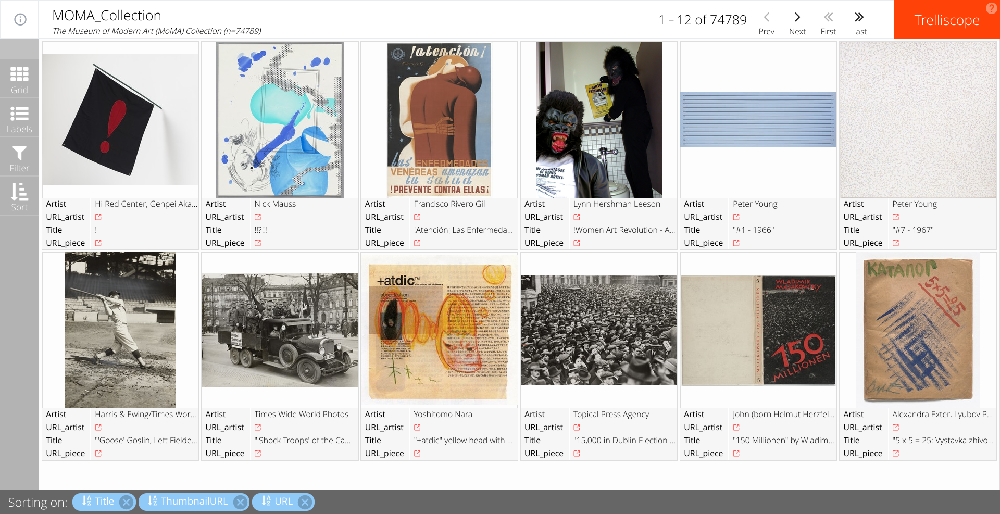
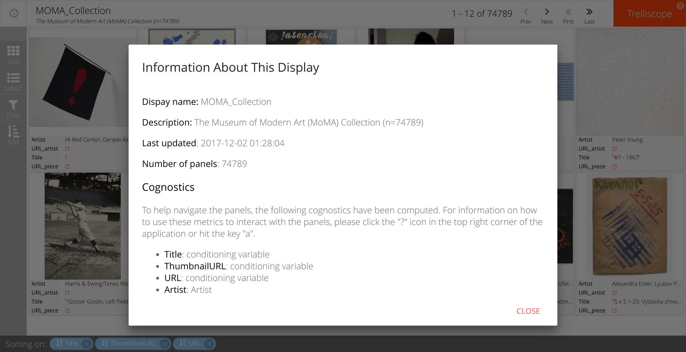
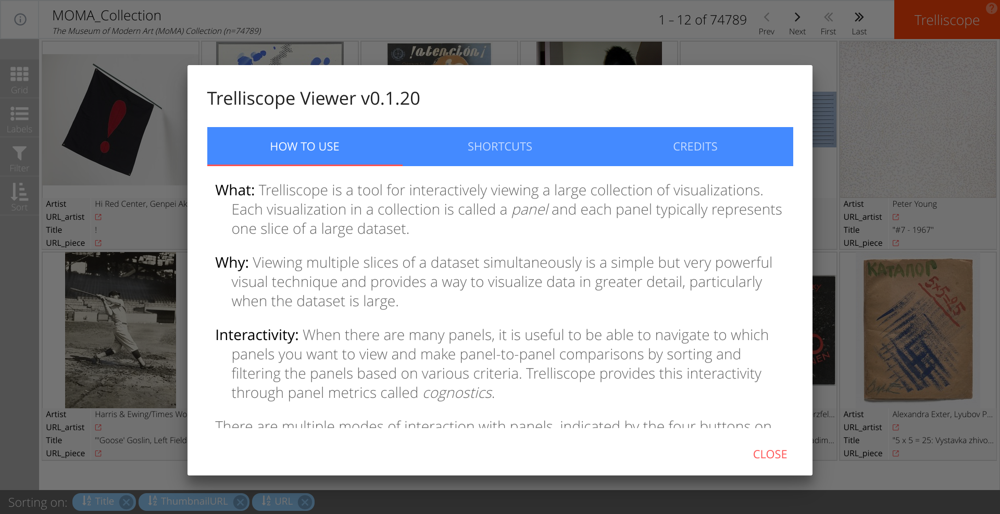
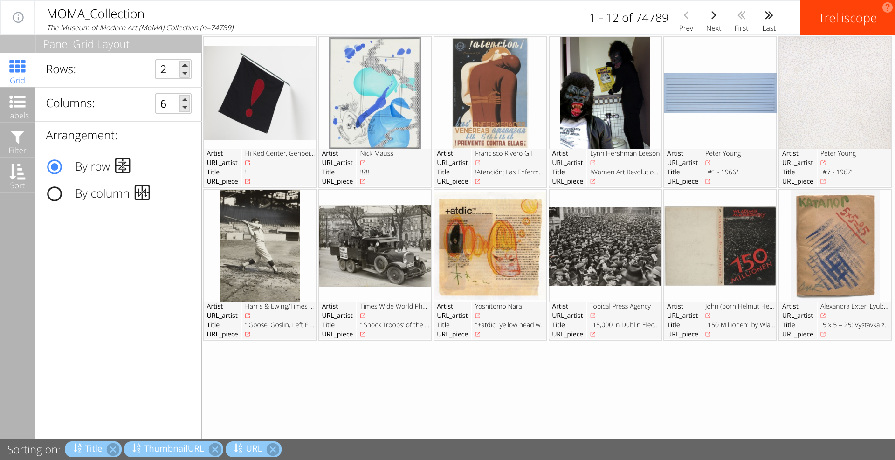
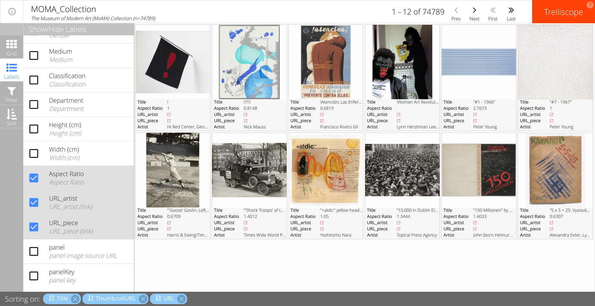
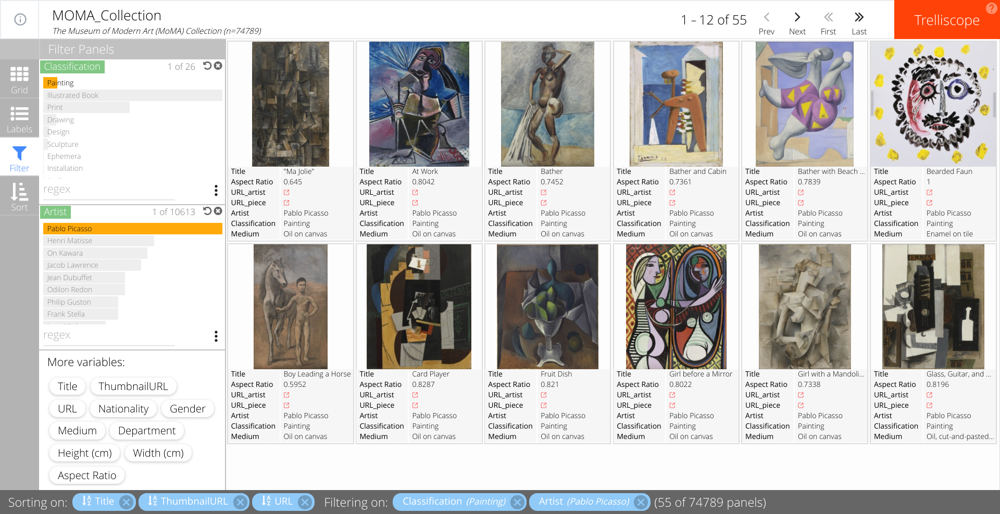
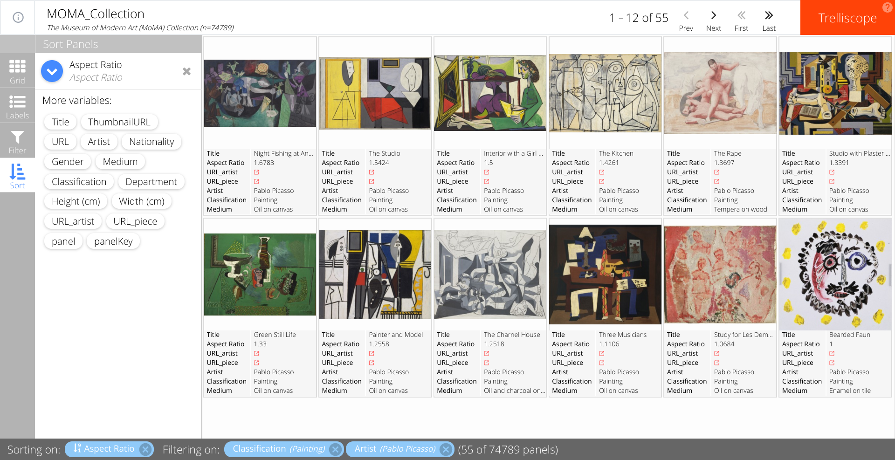

## Visualization of The Museum of Modern Art (MoMA) Collection using Trelliscope

<figure>

<figcaption>  
<a href="https://twitter.com/BauhausMovement/status/930213508041592833"> Source: Bauhaus Movement</a> 
</figcaption>
</figure>
<br><br>

### What is Trelliscope?
Trelliscope is a powerful, scalable, interactive approach to data visualization. The idea behind trelliscope is strongly embedded in the small multiples or trellis display, where data are split into groups and displayed into a grid. This technique is especially suitable for visualizing large datasets and making comparisons easier. Trelliscope was developed by  [Ryan Hafen](http://ryanhafen.com/) and further details can be found in [Ryan’s presentation: Modern Approaches to Data Exploration with Trellis Display](http://slides.com/hafen/trelliscopejs).

### The MoMA Collection
The Museum of Modern Art (MoMA) Collection contains nearly 200,000 works of art from around the world spanning the last 150 years. The Museum’s [website](https://www.moma.org/collection/) features 76,053 pieces from 21,635 artists. The museum made their artwork data publicly available through [GitHub]( https://github.com/MuseumofModernArt/collection) [](http://dx.doi.org/10.5281/zenodo.1069127).

### Other uses of this collection
We are certainly not the first one to use this rich database containing the MoMA Collection works of art. We originally heard of its existence through Oliver Roeder’s FiveThirtyEight article [A Nerd’s Guide To The 2,229 Paintings At MoMA]( https://fivethirtyeight.com/features/a-nerds-guide-to-the-2229-paintings-at-moma/).  If you are interested in a summary of how other people have used the MoMA’s data, Fiona Romeo’s [blog](https://medium.com/@foe/here-s-a-roundup-of-how-people-have-used-our-data-so-far-80862e4ce220) is a must-read. Our goal is to bring yet another dimension to the data by illustrating how to optimally visualize such a large collection using trelliscope.

### R code
The first step in data visualization is typically importing and cleaning/”wrangling” the dataset. For this task, we have opted to use the [tidyverse](https://www.tidyverse.org/). In short, the tidyverse is a set of R packages designed for data science that share a common data representation and API design. However, because the goal of this project is to illustrate how easy and useful the trelliscope approach is, we have limited the data cleaning to a minimum.

We need to install trelliscopejs from GitHub as the package is not yet in CRAN. Once the package is installed, we load it.

```
# Load tidyverse packages
library(tidyverse)
# install & load trelliscopejs  
devtools::install_github("hafen/trelliscopejs")
library(trelliscopejs)
```

Once we have both packages loaded, we are ready to import the data from the MoMA Github repository. We load all available data, which includes files dedicated to artworks and artists.

The “Artworks” data contains 132,150 records, representing all of the works that have been accessioned into MoMA’s collection and cataloged. It includes basic metadata for each piece, including title, artist, date made, medium, dimensions, and date acquired by the Museum.

The “Artists” dataset contains 15,366 records, representing all the artists who have work in MoMA's collection and have been cataloged in our database. It includes basic metadata for each artist. Although we are importing the Artists data, we will not be concentrating on it in our example.

```
# Import Data
Artsts1  <- read_csv("https://media.githubusercontent.com/media/MuseumofModernArt/collection/master/Artists.csv")
Artwrks1 <- read_csv("https://media.githubusercontent.com/media/MuseumofModernArt/collection/master/Artworks.csv")
```

After importing the data, we begin the data wrangling process. As mentioned previously, we decided to use tidyverse for this step as we feel the syntax is clearer to understand.  Our data wrangling consists of the following steps: 
1- Select the metadata we are interesting in visualizing (select) 
2- Clean the Nationality & Gender variable by removing necessary characters 
3- Create a new variable Aspect Ratio for each artwork based on Height & Width. 
4- Create a formatted URL for the artist & artwork piece 
5- Remove from the database all artworks that do not have a corresponding page in the MoMA website 
6- Create the unique identifier that will display each artwork image in its own panel using the function img_panel() 
7- Remove unnecessary variables

```
# data wrangling data
Artwrks2 <- Artwrks1 %>% 
select( Title, ThumbnailURL, URL, 
Artist, ConstituentID, Nationality, Gender,
Medium, Classification, Department,
`Height (cm)`, `Width (cm)`) %>%
mutate( Nationality = str_replace_all(Nationality,"[()]",""),
Gender = str_replace_all(Gender, "[()]",""),
`Aspect Ratio` = ifelse(`Height (cm)`>0 & `Width (cm)`>0, `Width (cm)`/`Height (cm)`,NA),
URL_artist = paste0("https://www.moma.org/artists/",ConstituentID),
URL_piece = as.character(URL) %>% str_replace("http://","https://")) %>%
filter( URL_piece != "NA") %>%
mutate( panel = img_panel(ThumbnailURL),
URL_piece = ifelse(is.na(URL_piece), "http://www.moma.org/collection/works", URL_piece)) %>% 
select(-ConstituentID)
```

We are now ready to build the code that will generate the visualization. We simply pass our dataset to the trelliscope() function and set a few options. **THAT IS IT**

```
#  run trelliscope
Artwrks2 %>% 
trelliscope(name = "MoMA Collection",
desc = paste0("The Museum of Modern Art (MoMA) Collection"," (n=",nrow(.),")"),
nrow = 2, ncol = 6,
state = list(labels = c("Artist","URL_artist","Title","URL_piece")),
path = "~/moma_trelliscopejs/app")
```

### Launch the Visualization App
Our resulting visualization can be accessed using the following [link]( https://agstn.github.io/moma_trelliscopejs/app/). The application is optimized to be quick. Case in point, the 75000 thousand curated artworks from this collection takes no more than 20 seconds to load using a decent internet connection. 



### Left / Right Help
Using the link at the top left of the app we can display information about the database. 



Similarly, the link on the top right-hand side will guide us through the instructions for navigating the visualization app.  We will briefly describe some of its more important features below. 



### Grid
The grid sidebar option is used to specify the layout of the grid of panels one wishes to display.  Our default display is 2 rows by 6 columns, but if you wish to increase the size of each image, you can change the grid size accordingly.


### Labels
The labels sidebar option lets you specify the artwork metrics that you wish to display by clicking the checkboxes. By default, the visualization app displays the title of the piece, the artist and their respective links on the MoMA website. Here we add the aspect ratio to the display.



### Filter
The filter sidebar option lets the user subset the display using any of the variables stored in the database. Barcharts and histograms are used for categorical and numeric variables, respectively, to represent the frequency of pieces that meet each filter condition. Below, we filtered the collection to all paintings by Pablo Picasso. There is a total of 55 pieces that fit these two conditions in the collection.



### Sort
Finally, the sort sidebar option lets the user specify the ordering of the panels.  One or more variables can be selected to sort upon, and the blue arrow dictates the direction of the ordering (ascending/descending). In the following example, we sort paintings by Picasso from largest to smallest aspect ratio. The first panel shows his painting with the largest aspect ratio while the last one shows his smallest, which in this case is a square.



